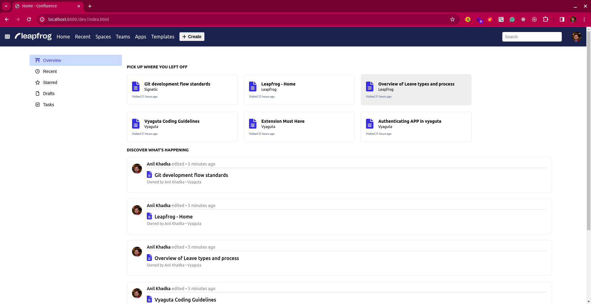
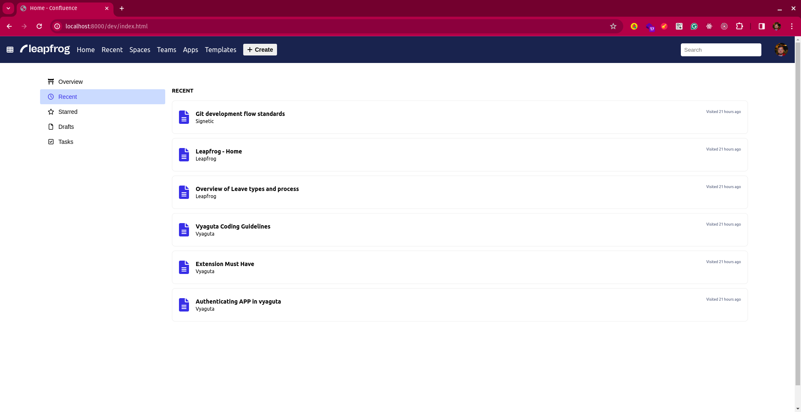

# Confluence

This project includes mock confluence page using LitElement with JavaScript.

This template is generated from the `lit-starter-js` package in [the main Lit repo](https://github.com/lit/lit). Issues and PRs for this template should be filed in that repo.

## Setup

### Install Dependencies

```bash
npm install
```

### Run Application

```bash
npm run serve
```

## Screenshots






